## Objetivo do Projeto: Análise dos Horários de Maior Incidência de Chuvas para Otimização da Coleta de Lixo e Redução de Alagamentos

Este MVP tem como objetivo analisar os horários com maior incidência de chuvas na cidade do Rio de Janeiro, com base em dados históricos de estações pluviométricas do sistema Alerta Rio, a fim de prever os períodos mais adequados para a liberação da coleta de lixo domiciliar. 

A motivação central do trabalho parte da constatação de que a coleta feita em horários com forte incidência de chuvas pode ser inviabilizada, fazendo com que o lixo acumulado nas calçadas seja arrastado para os bueiros, gerando obstruções que contribuem diretamente para alagamentos. 

Além dos impactos ambientais e sanitários, tais eventos interferem negativamente na mobilidade urbana, provocando engarrafamentos e transtornos à população.

Este projeto busca responder a pergunta de **Quais são os horários mais críticos de precipitação?**

# Detalhamento 
1. Busca pelos dados 
2. Coleta

## Fonte de Dados: Sistema Alerta Rio

O **Alerta Rio** é o sistema oficial da Prefeitura do Rio de Janeiro para monitoramento e emissão de alertas sobre chuvas intensas e riscos de deslizamentos em encostas. Criado em 1996 e gerenciado pela Fundação Geo-Rio, o sistema visa prevenir desastres naturais e proteger a população, especialmente em áreas vulneráveis.

O sistema conta com uma rede de **33 estações telemétricas** distribuídas por toda a cidade, que coletam dados de **chuva, temperatura, umidade, vento e pressão atmosférica** a cada **15 minutos**. Essas informações são processadas por meteorologistas, engenheiros e geólogos que monitoram as condições do tempo **24 horas por dia**.

🔗 [Link para download do site do AlertaRio](https://www.sistema-alerta-rio.com.br/download/dados-pluviometricos/)

# 3. Modelagem
# Catálogo de Dados

Todos os campos abaixo foram importados como `string` (texto), permitindo o pré-processamento e a validação dos formatos antes de conversões para tipos numéricos ou temporais. Formato xlsx de 2015 a 2025

| Nome da Coluna | Tipo   | Descrição                                                                 |
|----------------|--------|---------------------------------------------------------------------------|
| Dia            | string | Data da medição no formato `dd/mm/yyyy`.                                  |
| Hora           | string | Horário da medição no formato `hh:mm:ss`.                                 |
| 05 min         | string | Acúmulo de chuva nos últimos 5 minutos, em milímetros.                    |
| 10 min         | string | Acúmulo de chuva nos últimos 10 minutos, em milímetros.                   |
| 15 min         | string | Acúmulo de chuva nos últimos 15 minutos, em milímetros.                   |
| 01 h           | string | Acúmulo de chuva na última 1 hora, em milímetros.                         |
| 04 h           | string | Acúmulo de chuva nas últimas 4 horas, em milímetros.                      |
| 24 h           | string | Acúmulo de chuva nas últimas 24 horas, em milímetros.                     |
| 96 h           | string | Acúmulo de chuva nas últimas 96 horas, em milímetros.                     |

# 4. Carga 

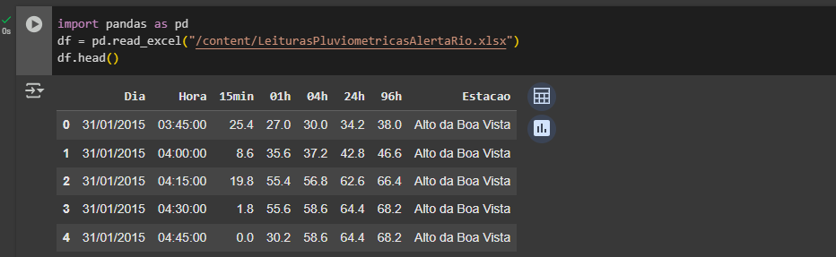

# 5. Análise

## a. Qualidade de Dados

O conjunto de dados inicialmente apresentava todos os campos como texto (`string`), o que dificultava as análises. Foi necessário fazer algumas correções para garantir a qualidade dos dados:

- A coluna **Dia** foi convertida para o formato de data (`datetime`).
- A coluna **Hora** foi transformada para mostrar apenas a hora inteira (ex: `22`), permitindo agrupar por horário.
- A coluna **01h**, que representa o valor da chuva acumulada em 1 hora, foi convertida de texto para número decimal (`float`).
- A coluna **Estacao** foi convertida para texto limpo e padronizado.

 ## b. Solução do Problema

Com o tratamento e integração dos dados pluviométricos das estações do Alerta Rio, foi possível realizar uma análise precisa da distribuição das chuvas na cidade.

A partir dos dados limpos, foi possível:

- Identificar os horários em que a chuva ocorreu com maior frequência;
- Determinar os horários com os maiores volumes acumulados de chuva;
- Analisar a variação da chuva ao longo do dia, considerando a média por hora;
- Detectar os picos de chuva registrados no período de **2015 a 2025**.

# Converte 'Dia' para datetime

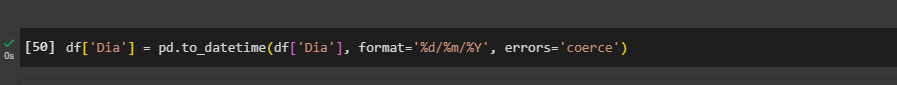

# Converte as colunas de leitura para float (caso não estejam)

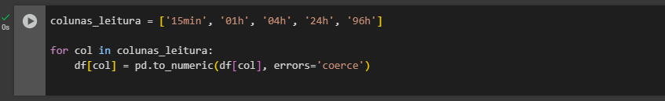

## Verifica a existência de dados nulos que possam comprometer o estudo

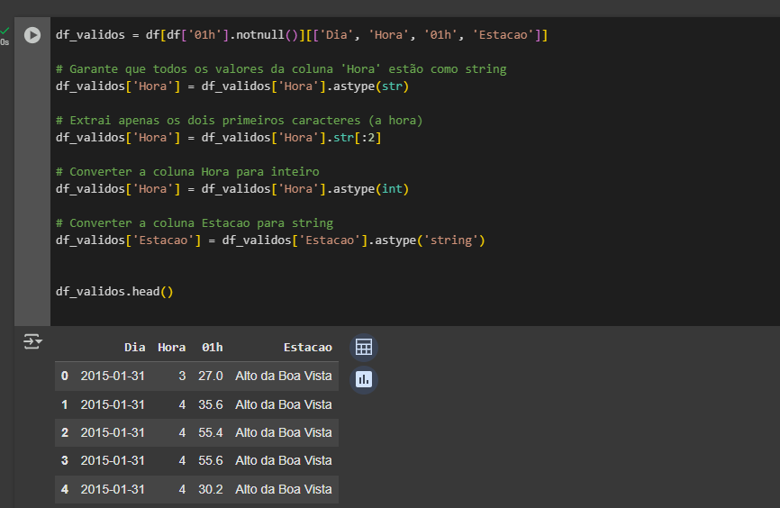

## Listar o Nome das Colunas após o filtrar apenas as necessárias para gerar a análise

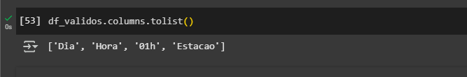

# Ver as primeiras linhas

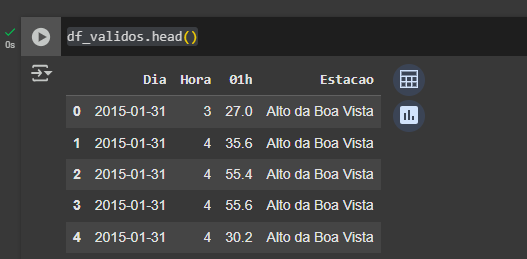

# Verificar se a conversão dos dados teve êxito

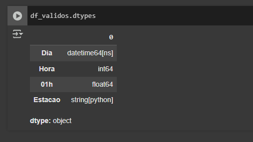

# Verifica a existência de dados duplicados de Leitura que que possam comprometer o estudo.
# Em caso de duplicado considerar a Leitura Máxima

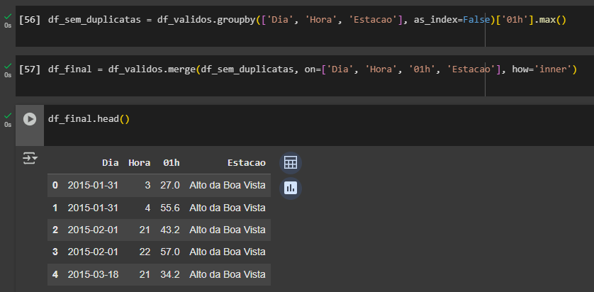

# Agrupar a chuva por Hora para fazer a Análise da Média de Chuva por hora no período de 2015 a 2025

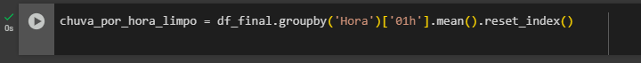

# Gerar Gráfico de Média de Chuva Acumulada por Hora desconsiderando leituras duplicadas

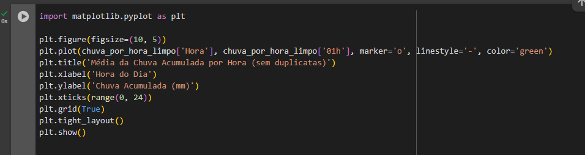

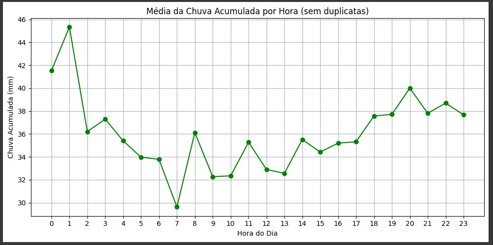

# Realizar a Análise considerando as leituras máximas em 1h no período

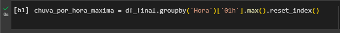

# Gerar Gráfico com a Análise considerando as leituras máximas em 1h no período

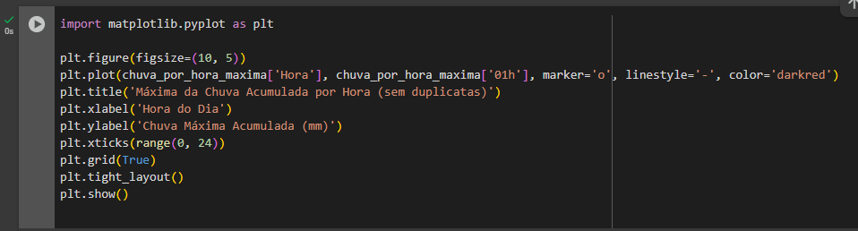

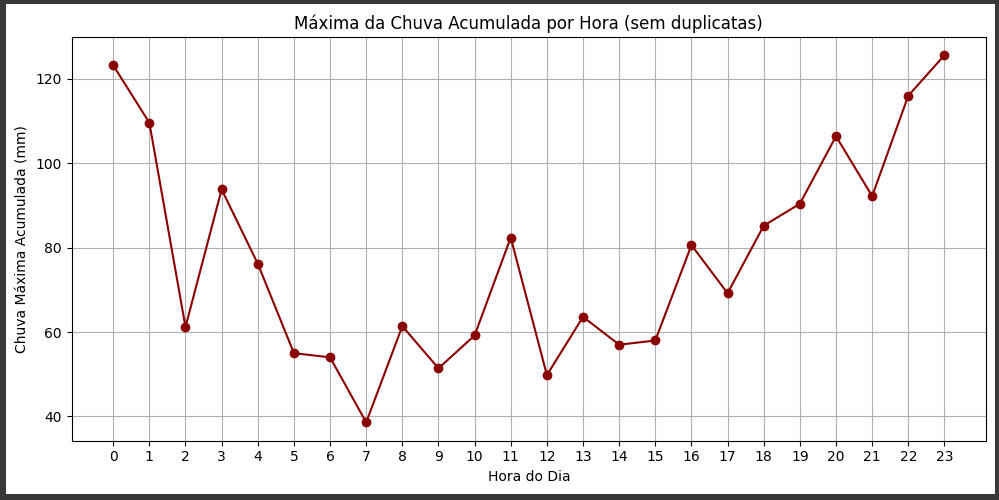

# Encontrar a linha com a maior acumulado do período

# Gerar Gráfico com a maior acumulado do período
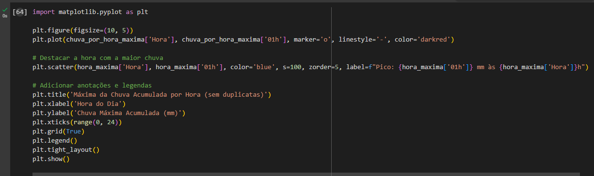

# Chuva Forte Tem Hora Marcada: Pico de Acúmulo Acontece no Início da Noite

**Dados revelam que o maior volume de chuva acumulada no Rio de Janeiro acontece entre 18h e 01h.**  
O horário coincide com o pico do trânsito, o fim do expediente e a circulação mais intensa de pessoas nas ruas.
---

## O que mostram os dados?

Estudo realizado com dados de estações pluviométricas da cidade mostra que o horário de maior intensidade de chuva, considerando os picos acumulados em uma hora, ocorre frequentemente no início da noite e madrugada.  
O levantamento analisou milhares de registros e filtrou os valores extremos, revelando que **a máxima registrada em uma hora chegou a mais de 125.6 mm/1h às 23h**.

---

## Destaques da análise

- **Horário mais crítico de chuva:** entre **18h e 01h**
- **Máxima registrada:** **125.6 mm** em uma hora

---

## Autoavaliação

Ao finalizar este trabalho, considero que consegui atingir os principais objetivos propostos, especialmente na organização e análise básica dos dados pluviométricos. Foi possível identificar padrões importantes, como os horários com maior incidência de chuva, e levantar possíveis impactos disso na cidade, como mobilidade urbana e risco de alagamentos.

Durante a execução, tive dificuldades iniciais com o uso do Databricks, o que consumiu um tempo considerável e me levou a migrar a análise para o Google Colab, onde consegui avançar melhor. Também tive que aprender a lidar com tipos de dados diferentes e entender como limpar e preparar os dados para análise — algo que nunca tinha feito antes com tanta profundidade.

Como trabalho futuro, pretendo melhorar meu conhecimento em SQL, gráficos e visualizações, além de estudar mais formas de cruzar esses dados com outras fontes, como lixo urbano ou trânsito. Assim, posso tornar esse projeto mais completo e útil para situações reais.

## Link para o Notebook

[Acesse o notebook no Google Colab](https://colab.research.google.com/drive/1wPr2L0-TH8fjkaL81-NdxH7ITP1mdxQN?usp=sharing)
